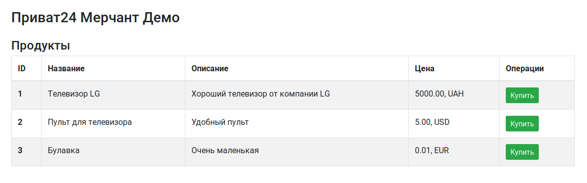

# Privat24 Merchant Demo



Демонстрация работы с мерчантом Приват24 для продажи товаров на сайте.

## Установка

1. Создайте базу данных и пользователя для неё в MySQL.
2. Загрузите таблицы в базу данных из файла `tables.sql`.
3. Укажите настройки мерчанта и данные подключения к MySQL в файле `config.php`.

## Запуск

Можно запустить сервер разработчика с помощью PHP и перейти по адресу http://127.0.0.1:4455/:

```
php -S 127.0.0.1:4455
```

На этой странице будет выведен список доступных товаров для покупки.
